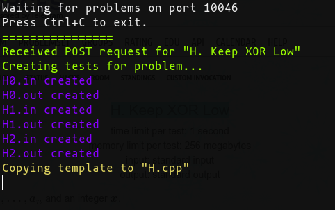

# competitive-companion-fetcher-node

Little HTTP Server written in node.js which works with [competitive-companion](https://github.com/jmerle/competitive-companion). It fetches a problem, parse the corresponding test files and generates a template for it

## Installation

1. Install [competitive-companion](https://github.com/jmerle/competitive-companion)
2. Set 10046 port as custom port for the extension (via the options menu)
3. Install required packages via `npm install`

## Usage
1. Run the server with `node .`
2. Press  button while being on a Codeforces button. This will copy your template and generate 2 files per pretest in the problem, with names `{letter_of_problem}{n_pretest}.in` and `{letter_of_problem}{n_pretest}.out`.
For example, for problem [H. Keep XOR Low
](https://codeforces.com/contest/1616/problem/H) it'll generate the files listed in the following image:

3. When finished fetching problems, press `Ctrl+C` to exit the fetcher

NOTES:
- Please consider changing the path to your template, the actual one refers to mine
- If you want to make an executable (Linux/MacOS) use `npm link`. By default, the name of the executable will be `cf_fetch`, but you could modify it in `package.json`

